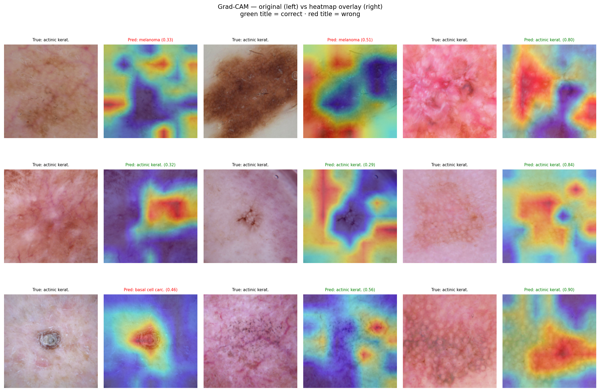
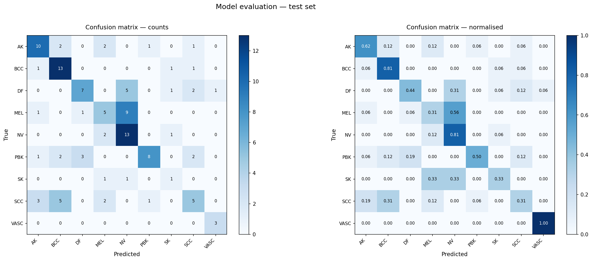
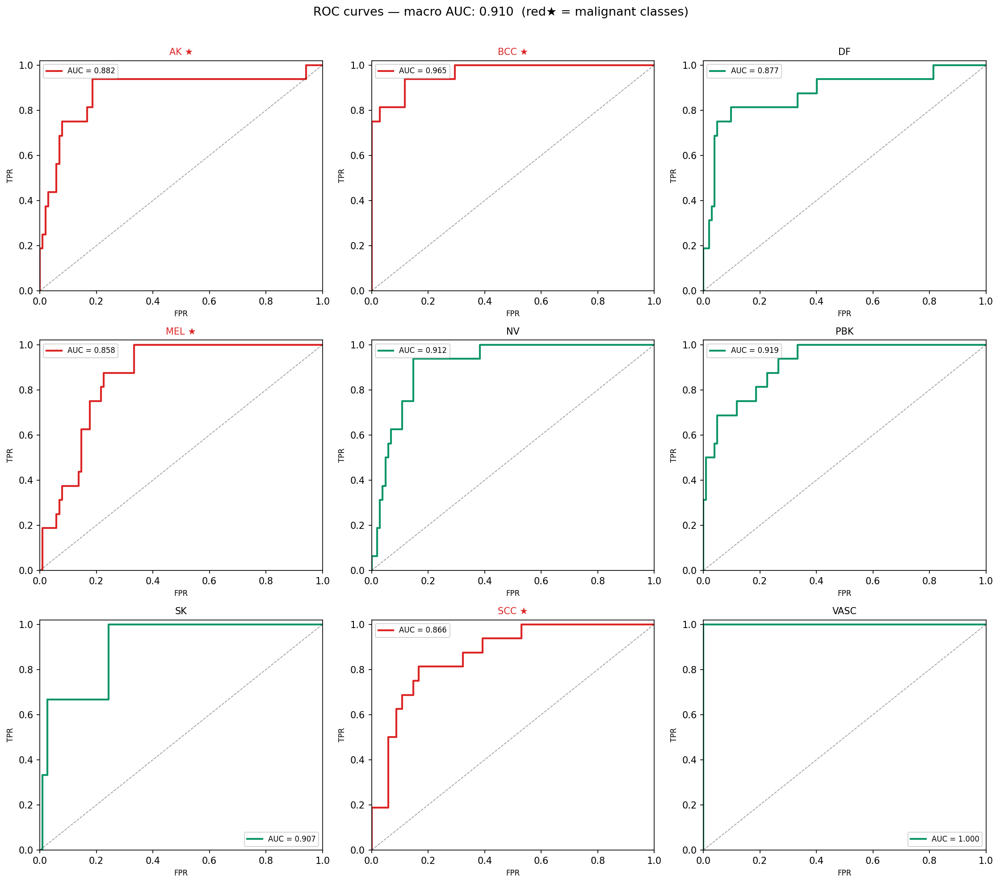

# Skin Cancer Detection with Deep Learning

A deep learning system for automated dermoscopy image classification 
across 9 skin lesion categories, with Grad-CAM visual explainability 
and a real-time Flask web application.


---

## Demo

[INSERT SCREENSHOT OF YOUR WEB APP HERE]

---

## Results

| Model | Val Accuracy | Macro AUC | Parameters | Inference Time |
|---|---|---|---|---|
| MobileNet-V3 ★ | 63.4% | 0.910 | 4.2M | ~12ms |
| ResNet-50 | 52.0% | — | 23.5M | ~38ms |
| EfficientNet-B4 | 48.9% | — | 17.6M | ~45ms |

★ Best model — used in web app deployment

### Per-class AUC (MobileNet-V3)

| Class | AUC | Sensitivity | Specificity |
|---|---|---|---|
| Vascular Lesion | 1.000 | 100.0% | 99.1% |
| Basal Cell Carcinoma | 0.965 | 81.2% | 91.2% |
| Pigmented Benign Keratosis | 0.919 | 50.0% | 98.0% |
| Nevus | 0.912 | 81.2% | 85.3% |
| Seborrheic Keratosis | 0.907 | 33.3% | 97.4% |
| Actinic Keratosis | 0.882 | 62.5% | 94.1% |
| Dermatofibroma | 0.877 | 43.8% | 96.1% |
| Squamous Cell Carcinoma | 0.866 | 31.2% | 94.1% |
| Melanoma | 0.858 | 31.2% | 93.1% |
| **Macro average** | **0.910** | **57.2%** | — |

---

## Project Overview

This project builds an end-to-end skin lesion classification system 
using the ISIC dermoscopy dataset. It demonstrates:

- Transfer learning with three CNN architectures
- Two-stage fine-tuning with differential learning rates
- Class imbalance handling with weighted loss
- Grad-CAM explainability for clinical transparency
- Flask web app deployment

---

## Dataset

**Source:** [ISIC Skin Cancer Dataset](https://www.kaggle.com/datasets/nodoubttome/skin-cancer9-classesisic)  
**Images:** 2,357 dermoscopy images  
**Classes:** 9 (4 malignant, 5 benign)  
**Split:** 1791 train / 448 val / 118 test

| Class | Images | Type |
|---|---|---|
| Melanoma | 454 | Malignant |
| Pigmented Benign Keratosis | 478 | Benign |
| Nevus | 373 | Benign |
| Basal Cell Carcinoma | 392 | Malignant |
| Squamous Cell Carcinoma | 197 | Malignant |
| Vascular Lesion | 142 | Benign |
| Dermatofibroma | 111 | Benign |
| Actinic Keratosis | 130 | Malignant |
| Seborrheic Keratosis | 80 | Benign |

---

## Architecture

### Transfer Learning Strategy
```
Stage 1 — Head only (15 epochs, lr=1e-3)
  Pretrained backbone → FROZEN
  New classification head → TRAINABLE
  Parameters trained: ~15K

Stage 2 — Full fine-tuning (10 epochs, lr=1e-5)
  Entire network → UNFROZEN
  Backbone LR: 1e-5 (gentle)
  Head LR:     1e-4 (faster)
  Parameters trained: 4.2M
```

### Models evaluated

- **ResNet-50** — Deep residual network with skip connections
- **EfficientNet-B4** — Compound-scaled architecture with SE attention
- **MobileNet-V3** — Lightweight depthwise separable convolutions

### Grad-CAM Explainability

Gradient-weighted Class Activation Mapping highlights which 
regions of the dermoscopy image most influenced the prediction.

[INSERT GRADCAM GRID IMAGE HERE — outputs/evaluation/gradcam_samples.png]

---

## Project Structure
```
skin_cancer_detection/
├── src/
│   ├── dataset.py       # transforms + SkinLesionDataset
│   ├── dataloader.py    # DataLoader factory
│   ├── model.py         # ResNet / EfficientNet / MobileNet builders
│   ├── train.py         # training loop + checkpointing
│   ├── evaluate.py      # metrics + visualisation
│   └── gradcam.py       # Grad-CAM implementation
├── notebooks/
│   ├── data_exploration.py
│   ├── 02_verify_preprocessing.py
│   ├── 03_verify_models.py
│   ├── 04_train.py
│   ├── 04b_finetune.py
│   └── 05_evaluate.py
├── webapp/
│   ├── app.py           # Flask backend
│   └── templates/
│       └── index.html   # frontend UI
├── outputs/
│   └── evaluation/
│       ├── confusion_matrix.png
│       ├── roc_curves.png
│       └── gradcam_samples.png
└── README.md
```

---

## Installation
```bash
# Clone the repository
git clone https://github.com/YOUR_USERNAME/skin-cancer-detection.git
cd skin-cancer-detection

# Install dependencies
pip install -r requirements.txt

# Download dataset from Kaggle
kaggle datasets download -d nodoubttome/skin-cancer9-classesisic
unzip skin-cancer9-classesisic.zip -d dataset_ISIC/
```

---

## Usage

### 1. Data exploration
```bash
python notebooks/data_exploration.py
```

### 2. Verify preprocessing
```bash
python notebooks/02_verify_preprocessing.py
```

### 3. Train all models (Stage 1)
```bash
python notebooks/04_train.py
```

### 4. Fine-tune (Stage 2)
```bash
python notebooks/04b_finetune.py
```

### 5. Evaluate
```bash
python notebooks/05_evaluate.py
```

### 6. Run web app
```bash
python webapp/app.py
# Open http://127.0.0.1:5000
```

---

## Sample Results

### Confusion Matrix


### ROC Curves


### Training Curves


---

## Requirements
```
torch>=2.0.0
torchvision>=0.15.0
flask>=2.3.0
pandas>=2.0.0
numpy>=1.24.0
matplotlib>=3.7.0
scikit-learn>=1.3.0
pillow>=10.0.0
```

---

## Key Design Decisions

**Why rotation before crop?**  
Applying RandomRotation after CenterCrop can slice off lesion borders — 
a primary diagnostic feature. Resizing to 280px before rotating creates 
a 56px buffer zone so borders are always preserved.

**Why MobileNet-V3 won?**  
Despite being smallest, MobileNet's preserved two-layer head gave it 
more trainable capacity in Stage 1, and its smaller parameter count 
acts as implicit regularisation on our 1,791-image dataset.

**Why class weights?**  
Seborrheic keratosis has 80 training images vs 478 for pigmented benign 
keratosis. Without weighting, the model ignores rare classes. 
SK gets a 3.21× penalty multiplier in the loss function.

---

## Limitations

- Melanoma sensitivity is 31.2% — not suitable for clinical deployment
- Test set is small (118 images) — metrics have high variance
- CPU-only training — limited epochs and no ensembles
- No external validation on unseen hospital data

---

## Clinical Notice

This is a research and educational project. 
All predictions must be reviewed by a qualified dermatologist 
before any clinical decision is made.

---

## License

MIT License — see LICENSE file for details.

---

## Acknowledgements

- ISIC (International Skin Imaging Collaboration) for the dataset
- PyTorch team for the deep learning framework
